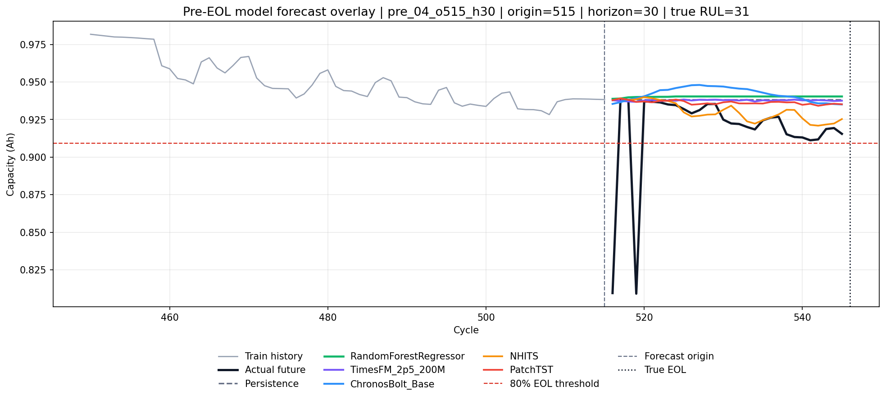
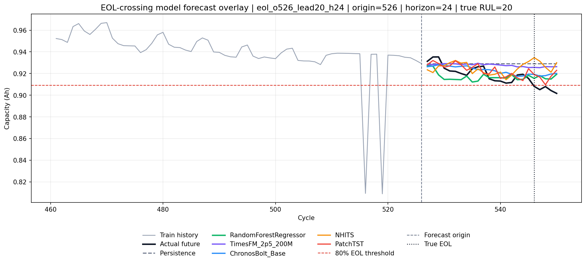
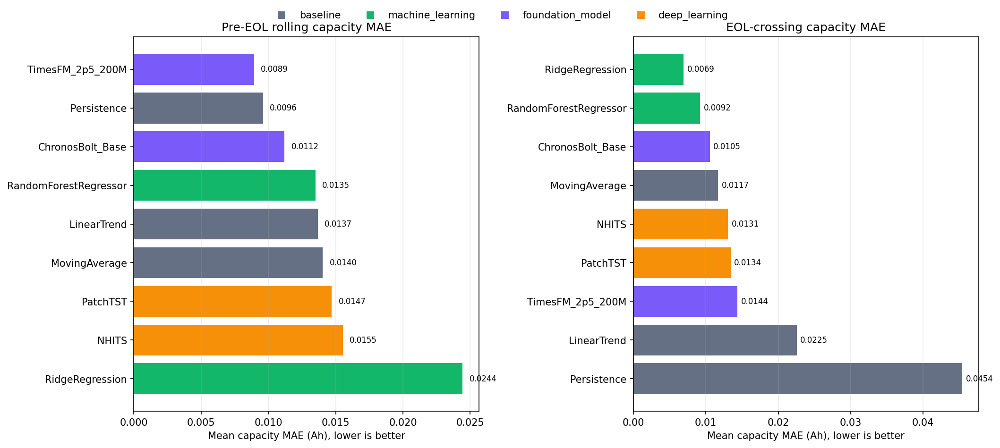
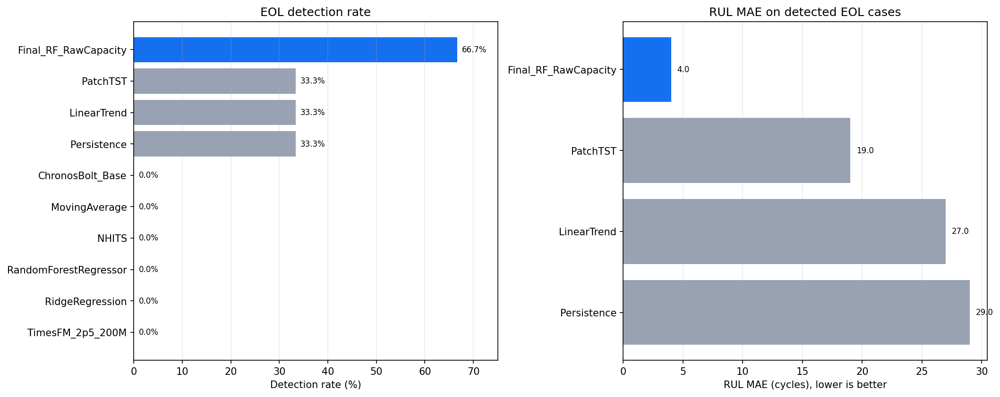
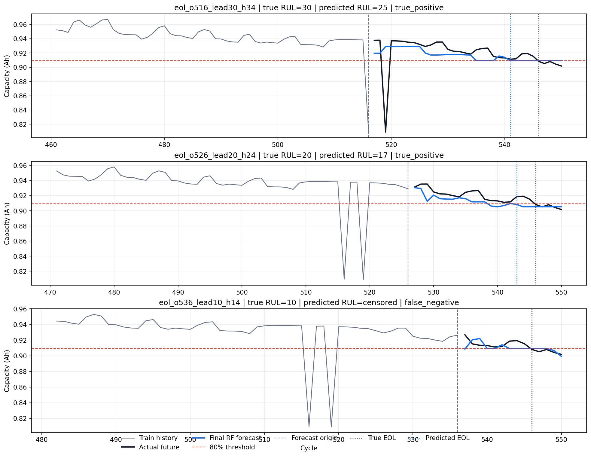
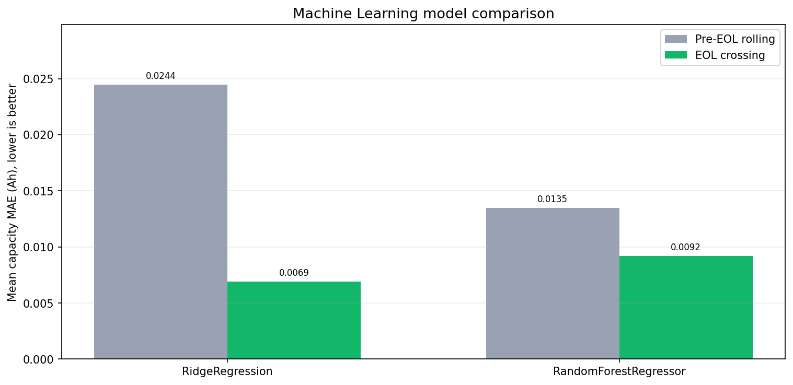
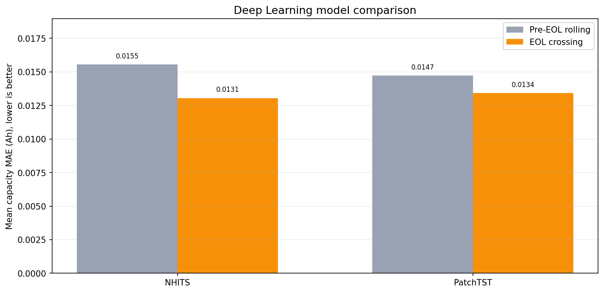
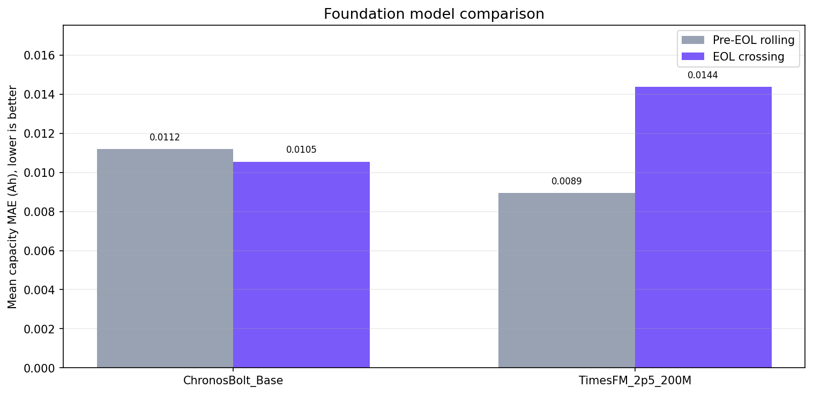

# Battery Predictive Maintenance Analysis

CALCE Li-ion battery aging 데이터를 사용해 배터리 capacity fade, SoH, EOL, RUL을 분석하고 예지보전 의사결정으로 연결하는 시계열 예측 프로젝트입니다.

이 프로젝트는 단순히 capacity를 예측하는 것보다, 예측 결과를 정비 의사결정에 연결하는 것을 목표로 합니다.

```text
capacity forecast -> predicted SoH -> predicted EOL -> predicted RUL -> risk decision
```

## 1. Project Summary

| Item | Description |
| --- | --- |
| Domain | Battery Predictive Maintenance |
| Dataset | CALCE CS2_35 Li-ion battery aging data |
| Primary Target | `capacity_ah` |
| Derived Signals | SoH, EOL cycle, RUL, risk level |
| Final Model | `capacity_raw + RandomForestRegressor` |
| Optional Viewer | Streamlit |

데이터 출처는 [CALCE Battery Data](https://calce.umd.edu/battery-data)입니다.

### Dataset Citation

CALCE CS2 Battery data 사용 시 다음 관련 논문을 함께 참고합니다.

- Wei He, Nicholas Williard, Michael Osterman, Michael Pecht, "Prognostics of lithium-ion batteries based on Dempster-Shafer theory and the Bayesian Monte Carlo method," Journal of Power Sources, 196(23), pp. 10314-10321, 2011.
- Yinjiao Xing, Eden Ma, Kwok Leung Tsui, Michael Pecht, "An Ensemble Model for Predicting the Remaining Useful Performance of Lithium-ion Batteries," Microelectronics Reliability, 53(6), pp. 811-820, 2013.
- Nick Williard, Wei He, Michael Osterman, Michael Pecht, "Comparative Analysis of Features for Determining State of Health in Lithium-Ion Batteries," International Journal of Prognostics and Health Management, 4, pp. 1-7, 2013.

현재 구현은 `CS2_35` 데이터를 기준으로 구성했습니다. 원본 25개 Excel 파일 중 fingerprint 기준 중복 파일 1개를 제외하고, 24개 고유 파일에서 cycle-level 데이터를 생성했습니다.

## 2. Key Results

최종 pipeline 후보는 `capacity_raw + RandomForestRegressor`입니다.

최종 모델은 EOL crossing 3개 scenario 중 2개를 탐지했습니다.

| Metric | Value |
| --- | ---: |
| True Positive | 2 |
| False Negative | 1 |
| False Positive | 0 |
| True Negative | 12 |
| EOL Detection Rate | 66.67% |
| False Alarm Rate | 0.00% |
| RUL MAE on Detected Cases | 4.0 cycles |
| RUL Bias | -4.0 cycles |

탐지된 EOL crossing scenario는 다음과 같습니다.

| Scenario | Forecast Origin | True RUL | Predicted EOL Cycle | Predicted RUL | RUL Error |
| --- | ---: | ---: | ---: | ---: | ---: |
| `eol_o516_lead30_h34` | 516 | 30 | 541 | 25 | -5 |
| `eol_o526_lead20_h24` | 526 | 20 | 543 | 17 | -3 |

RidgeRegression은 EOL crossing 구간의 point-wise capacity MAE가 가장 낮았지만, EOL/RUL event를 탐지하지 못했습니다. 따라서 최종 모델은 capacity MAE만 기준으로 고르지 않고, EOL/RUL 의사결정 성능까지 함께 고려해 선정했습니다.

## 3. Performance Visualizations

### Forecast Behavior Comparison

아래 시계열 예측 그래프는 같은 forecast origin에서 모델별 capacity forecast가 실제 future capacity와 어떻게 달라지는지 보여줍니다. 막대그래프가 정량 순위를 보여준다면, 이 그래프는 모델별 예측 성향과 threshold 근처의 판단 차이를 보여줍니다.

Pre-EOL 구간에서는 실제 capacity가 일시적으로 크게 흔들리는 구간이 있으며, 일부 모델은 이를 충분히 따라가지 못합니다.



EOL crossing 구간에서는 모델별 forecast가 80% threshold 근처에서 다르게 움직입니다. 이 차이가 predicted EOL과 RUL 의사결정 차이로 이어집니다.



### Capacity MAE Comparison

Pre-EOL rolling에서는 TimesFM이 가장 낮은 capacity MAE를 보였고, EOL crossing에서는 RidgeRegression과 RandomForestRegressor가 강했습니다.



### EOL/RUL Decision Comparison

08번 개선 실험 이후의 최종 RF 모델은 기존 07번 모델 비교 결과보다 EOL detection rate와 detected RUL MAE가 개선되었습니다.



### Final RF Forecast Examples

아래 그림은 최종 RandomForest 모델이 EOL crossing scenario에서 capacity와 EOL을 어떻게 예측했는지 보여줍니다.



### Machine Learning Model Comparison

전통 ML 계열에서는 RidgeRegression이 EOL crossing capacity MAE는 가장 낮았지만, 최종 EOL/RUL 의사결정에서는 RandomForestRegressor가 더 좋은 결과를 보였습니다.



### Deep Learning Model Comparison

Deep learning 계열에서는 NHITS와 PatchTST를 비교했습니다. 두 모델 모두 EOL crossing capacity MAE는 비슷한 수준이지만, 07번 RUL 평가에서는 PatchTST만 q50 기준 EOL을 일부 탐지했습니다.



### Foundation Model Comparison

Foundation model 계열에서는 TimesFM 2.5 200M과 Chronos-Bolt를 비교했습니다. TimesFM은 Pre-EOL rolling에서 가장 낮은 capacity MAE를 보였고, Chronos-Bolt는 EOL crossing에서 더 안정적인 capacity MAE를 보였습니다.



## 4. Data Pipeline

전체 흐름은 다음과 같습니다.

```text
CALCE raw Excel
-> cycle-level preprocessing
-> SoH/RUL labeling
-> rolling forecast scenarios
-> model comparison
-> target improvement experiment
-> final RandomForest pipeline
-> optional Streamlit viewer
```

주요 처리 기준은 다음과 같습니다.

| Step | Rule |
| --- | --- |
| Modeling cycles | `is_modeling_cycle == True`인 868개 표준 full cycle |
| Initial capacity | 첫 5개 modeling cycle의 평균 capacity |
| SoH | `capacity_ah / initial_capacity` |
| EOL threshold | SoH 0.80 |
| EOL confirmation | 5개 modeling cycle 연속 threshold 미만 |
| True EOL cycle | 546 |

`RUL`은 직접 예측 target이 아닙니다. 모델은 `capacity_ah`를 예측하고, 예측 capacity를 SoH로 변환한 뒤 EOL threshold crossing으로 RUL을 계산합니다.

## 5. Models Compared

다음 모델을 같은 rolling scenario에서 비교했습니다.

| Family | Models |
| --- | --- |
| Baseline | Persistence, MovingAverage, LinearTrend |
| Machine Learning | RidgeRegression, RandomForestRegressor |
| Foundation Model | TimesFM 2.5 200M, Chronos-Bolt |
| Deep Learning | NHITS, PatchTST |

Foundation model과 deep learning model은 비교군으로 사용했습니다. 최종 분석 pipeline은 08번 개선 실험에서 가장 의사결정 성능이 좋았던 `capacity_raw + RandomForestRegressor`를 사용합니다.

## 6. Project Structure

```text
Battery_TimeSeries_Analysis/
├── app/
│   └── streamlit_app.py
├── data/
│   ├── raw/
│   └── processed/
├── docs/
│   ├── project_structure.md
│   ├── data_plan.md
│   ├── data_columns.md
│   └── notebook_docs/
├── notebooks/
│   ├── 01_raw_data_inspection.ipynb
│   ├── 02_cycle_level_preprocessing.ipynb
│   ├── 03_soh_rul_labeling.ipynb
│   ├── 04_capacity_fade_analysis.ipynb
│   ├── 05_capacity_ah_baseline_forecasting.ipynb
│   ├── 06_time_series_model_forecasting.ipynb
│   ├── 07_rolling_backtest_and_rul_evaluation.ipynb
│   └── 08_model_improvement_calibration.ipynb
├── outputs/
├── reports/
│   └── figures/
└── src/
    └── battery_pdm/
        ├── pipeline.py
        └── run_final_evaluation.py
```

## 7. How to Run

명령은 `Battery_TimeSeries_Analysis/` 폴더 기준입니다.

### Final Pipeline

```bash
uv run python src/battery_pdm/run_final_evaluation.py
```

`src/battery_pdm/` 폴더 안에서 실행할 경우에는 다음 명령을 사용할 수 있습니다.

```bash
uv run python run_final_evaluation.py
```

Pipeline 실행 결과는 다음 위치에 저장됩니다.

```text
outputs/csv/evaluation/final/
outputs/parquet/evaluation/final/
```

### Optional Streamlit Viewer

```bash
uv run streamlit run app/streamlit_app.py
```

기본 접속 주소는 다음과 같습니다.

```text
http://localhost:8501
```

Streamlit viewer는 모델을 실시간으로 학습하지 않고, final artifact를 읽어서 결과를 확인하는 보조 도구입니다.

## 8. Optional Viewer

Streamlit viewer는 다음 결과를 확인할 수 있습니다.

| Area | Description |
| --- | --- |
| KPI | latest cycle, latest SoH, true EOL, predicted RUL, EOL detection rate |
| Overview | capacity history, SoH trend, 80% EOL threshold |
| Forecast Viewer | scenario별 train history, actual future, RandomForest forecast |
| Decision Table | scenario별 predicted RUL, event status, RUL error |
| Leaderboard | TP, FN, FP, TN, EOL detection rate, false alarm rate, RUL MAE |

`Train history window`는 forecast 차트에서 예측 시작점 이전의 과거 cycle을 몇 개까지 보여줄지 조절하는 시각화 옵션입니다. 이 값은 모델 학습이나 예측 결과를 변경하지 않습니다.

## 9. Main Artifacts

최종 분석과 optional viewer가 사용하는 artifact는 다음과 같습니다.

```text
data/processed/paraquet/battery_cycles_labeled.parquet
outputs/csv/evaluation/final/final_rf_forecasts.csv
outputs/csv/evaluation/final/final_rf_rul_predictions.csv
outputs/csv/evaluation/final/final_rf_decision_leaderboard.csv
```

CSV는 사람이 확인하기 위한 파일이며, Parquet은 pipeline과 viewer에서 빠르게 읽기 위한 파일입니다.

## 10. Final Result

최종 모델은 `capacity_raw + RandomForestRegressor`로 선정했습니다.

이 모델은 EOL crossing 3개 scenario 중 2개를 탐지했으며, false alarm 없이 66.67%의 EOL detection rate를 보였습니다. 탐지된 case 기준 RUL MAE는 4.0 cycles입니다.

따라서 본 프로젝트는 단순 capacity 예측보다, 예측 결과를 SoH, EOL, RUL, risk decision으로 연결해 배터리 예지보전 의사결정에 활용할 수 있음을 확인했습니다.
